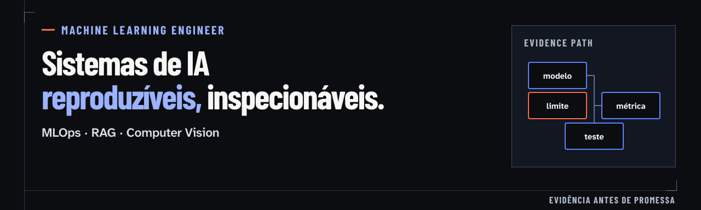
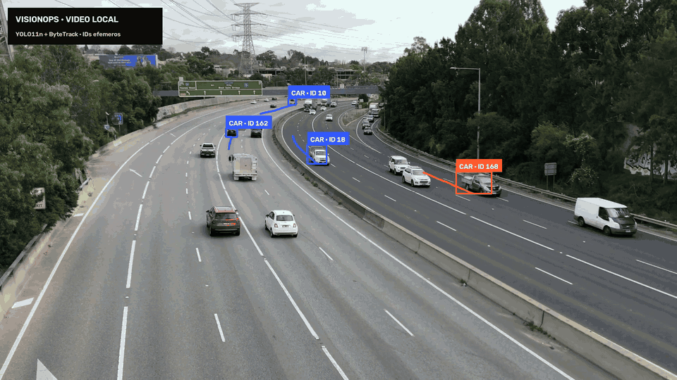
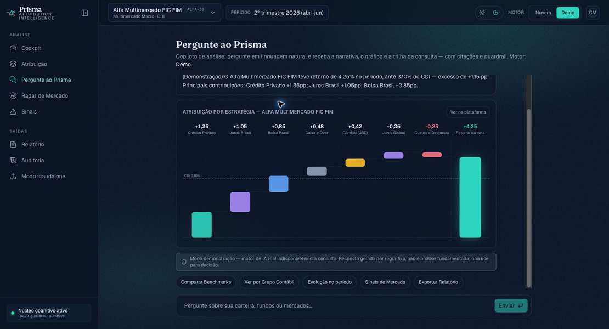
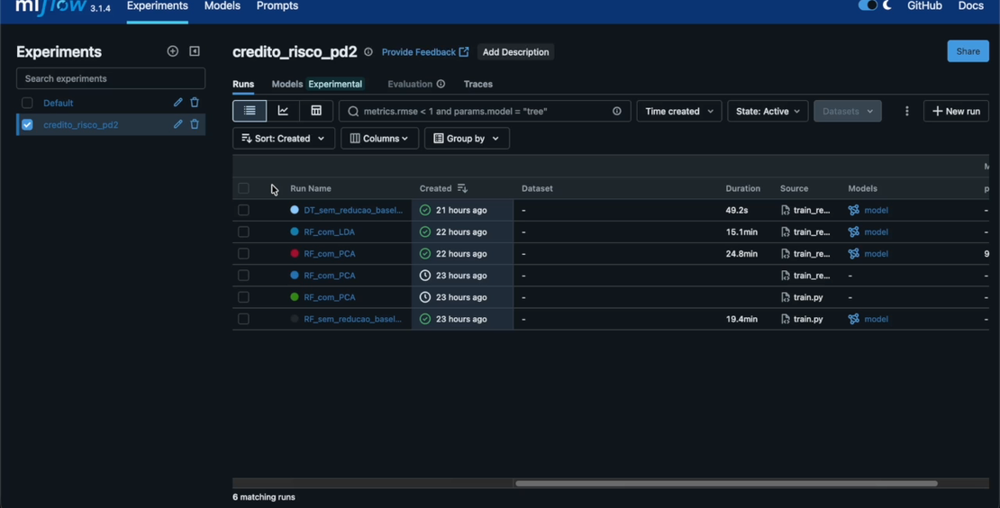

# Fabio Figueiredo

**Machine Learning Engineer · AI Engineer · Cientista de Dados Sênior**

Eu gosto de projetos em que outra pessoa consegue abrir o repositório e entender o que foi
executado, como foi medido e onde estão os limites.

Meu foco hoje está na parte que conecta modelagem e software: MLOps, RAG e visão computacional.

[Portfólio](https://fabiofigueiredo.vercel.app/) · [LinkedIn](https://www.linkedin.com/in/fabio-ffigueiredo-datascience/) · [E-mail](mailto:fabio.f.figueiredo@gmail.com)

## Projetos que mostram como eu trabalho

### VisionOps Realtime: detecção e tracking em movimento

Neste recorte, o YOLO11n detecta veículos e o ByteTrack associa quatro deles ao longo dos frames.
As outras caixas permanecem como detecções do frame. Limitei os IDs para não esconder a estrada.

É uma demonstração local sobre vídeo licenciado. Não mede acurácia, throughput de vídeo ou
capacidade de uma estrada em produção.

[Ver código, testes e limites](https://github.com/fabioffigueiredo/visionops-realtime)

### PRISMA: uma resposta que deixa rastro

Uma pergunta entra. A resposta volta com fontes. No modo Demo determinístico, o fluxo registra as
fontes recuperadas, o motor usado, a latência e um hash da consulta.

É uma prova de conceito pública com dados fictícios. Não é produto em produção nem recomendação
financeira.

[Ver o commit usado na demonstração](https://github.com/fabioffigueiredo/FinRAG_Prisma/tree/e1b8cf5ed865)

### MLOps: métrica não é decisão

Este experimento acadêmico usa MLflow e Streamlit para deixar o treinamento inspecionável. O
pipeline mantém o tratamento de outliers dentro do treino e expõe o trade-off entre F1, Precision
e Recall sem transformar um score em aprovação ou recusa de crédito.

[Ver o commit com os limites metodológicos](https://github.com/fabioffigueiredo/pd_operacionalizao_modelos_mlops/tree/9358182)

## Projeto complementar

### FinNLP: do endpoint à resposta

Um cenário fictício percorre `POST /api/analyze`, `PipelineService` e uma resposta JSON com
sentimento, entidades, tópico e textos similares. A interface mostra o caminho executado sem
tratar a demonstração como produto financeiro.

[Ver o FinNLP](https://github.com/fabioffigueiredo/finnlp_performance_attribution/tree/a145e0f)

## Como eu construo

- **Código executável:** a interface precisa apontar para um caminho que outra pessoa consiga revisar.
- **Métrica com protocolo:** um número público precisa informar ambiente, método e o que ele não mede.
- **Limite visível:** experimento, demonstração e produção não são tratados como a mesma coisa.

## Direção técnica

Python · FastAPI · scikit-learn · MLflow · RAG/LLM evaluation · Computer Vision · MLOps · testes · governança de dados

## Formação

Pós-graduação em Inteligência Artificial, Machine Learning e Deep Learning pelo Instituto Infnet,
concluída em 2026.

## Contato

[Portfólio](https://fabiofigueiredo.vercel.app/) · [LinkedIn](https://www.linkedin.com/in/fabio-ffigueiredo-datascience/) · [E-mail](mailto:fabio.f.figueiredo@gmail.com)
